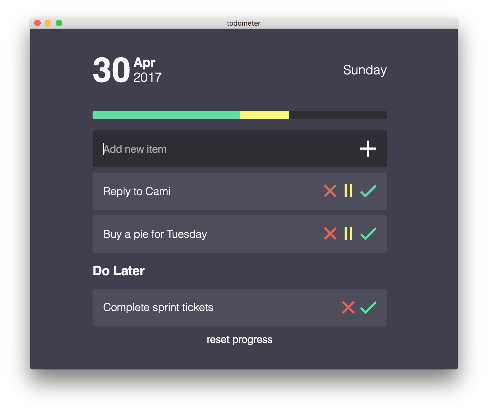

[todometer](http://cassidoo.github.io/todometer)
=========

A simple meter-based to-do list built with Electron, React, Redux, and LESS.



### Contributing

So you want to contribute? Yay! Great! Fun!
I love seeing new PRs for todometer. That being said, not every pull request will be merged. The general guidelines I'll follow are:

 - Does it make developing todometer easier?
 - Does it help other platforms (Windows, Mac, Linux) work better?
 - Does it fix a bug?
 - Does it keep todometer simple?
 - Does it break anything?
 - Does it stick to the original goal of todometer (a _simple_, meter-based to-do list)
 - Is it necessary?
 
Regarding that last point, I don't expect all pull requests to be absolutely necessary. New features are good. That being said, if the new features make the app unnecessarily complex in some way without bringing value to the users, it won't be merged.

Please don't be hurt if your PR isn't merged. You're lovely for working on it. If you are thinking about working on something, feel free to make an issue beforehand so that you can make sure it'll be worth your time!

### Development

- Clone the repo:
```
git clone https://github.com/cassidoo/todometer.git
```

- Go to the project directory and install dependencies: 
```
cd todometer && npm install
```

- Run `npm start` to show the Electron application window with your current build.

- Add `mainWindow.webContents.openDevTools()` to the `app.on('ready')` listener in `main.js` to view the dev tools.
