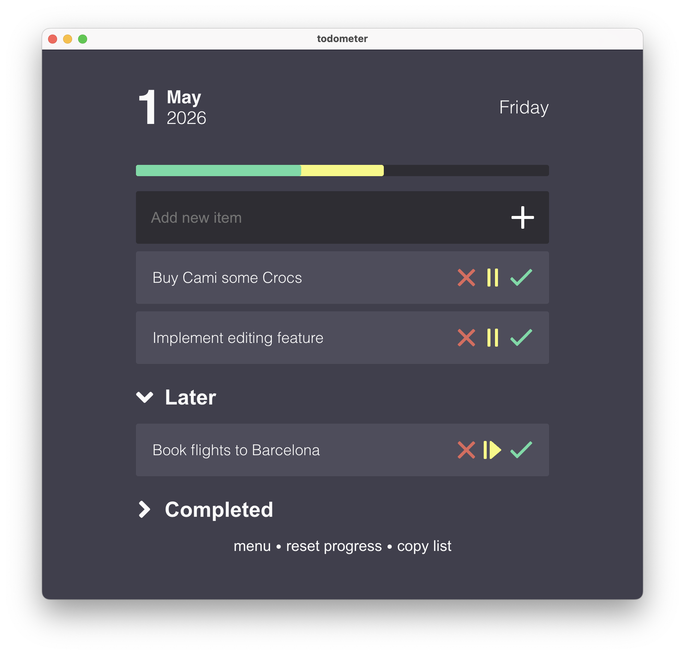

[](https://mseep.ai/app/cassidoo-todometer)

# todometer

A simple, meter-based to-do list built with Electron and React.



## Download

Nab the latest version from the [Releases](https://github.com/cassidoo/todometer/releases) page!

## Web clipper

You can install the [todometer web clipper](https://github.com/cassidoo/todometer-web-clipper) to your favorite browser to add tasks to todometer with a single click!

## Development

- Clone the repo:

```bash
$ git clone https://github.com/cassidoo/todometer.git
```

- Go to the project directory and install dependencies:

```bash
$ cd todometer && npm install
```

To show the Electron application window with your current build:

```bash
$ npm run dev
```

To build a production version:

```bash
$ npm install
$ npm run postinstall
$ npm run pre-electron-pack
$ npm run pack           # all platforms
$ npm run pack:mac       # macOS only (DMG + ZIP)
$ npm run pack:win       # Windows only (NSIS installer)
$ npm run pack:linux     # Linux only (AppImage)
```

See more in the Release documentation.

## Features

- Add, complete, pause, and delete to-do items
- Drag and drop to reorder items or move them between groups
- Daily auto-reset with optional notifications and reminders
- **Settings drawer** — click **menu** at the bottom of the app to configure:
  - Notification preferences (reset notifications, reminder frequency)
  - Data vault location (move your database anywhere)
  - Display options (show/hide reset and copy buttons)
  - Local REST API and MCP server for external integrations
- **[API & MCP integration](docs/api-and-mcp-setup.md)** — control todometer from scripts, shortcuts, or AI assistants
- **Protocol handler** — add todos via `todometer://add?text=...` URLs

## Contributing

See [the contribution guidelines](docs/CONTRIBUTING.md)!
